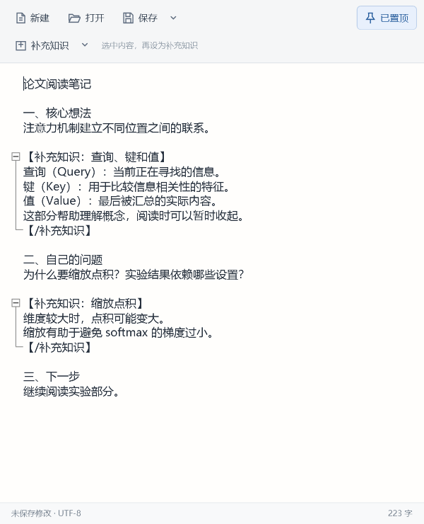

# 置顶记事本 / Topmost Notepad

一个用于阅读论文和文章时做笔记的 Windows 小工具。窗口默认置顶，支持打开和保存 TXT，也能把补充知识折叠起来，让阅读笔记保持清楚。


## 下载与使用

下载 [便携版程序包](dist/置顶记事本.zip)，解压后双击 `置顶记事本.exe`。无需安装，移动时请保留整个文件夹。适用于 Windows 10/11，使用 .NET Framework 4.8。

- **新建、打开、保存 TXT：** 新笔记使用 UTF-8。打开已有文件时支持 UTF-8、带 BOM 的 UTF-16/32，以及常见中文 GBK/GB18030。保存前会提醒未保存的修改。
- **窗口置顶：** 默认开启，点击右上角的开关即可切换。
- **补充知识折叠：** 选中文字后点击“补充知识”，文字会成为可收起的知识块；未选中文字时点击该按钮，则插入一个可以直接填写的空块。点击左侧的 `＋/－` 展开或收起。
- **纯文本保存：** 折叠仅改变显示，TXT 仍保存全部内容。重新打开文件后，知识块会自动识别并收起。

可以先打开 [折叠示例](examples/折叠示例.txt) 试用。展开效果如下：



常用快捷键：`Ctrl+N` 新建、`Ctrl+O` 打开、`Ctrl+S` 保存、`Ctrl+Shift+S` 另存为、`Ctrl+T` 切换置顶、`Ctrl+Shift+K` 添加补充知识。更多用法见程序包中的 `使用说明.txt`。

## 源码与构建

`src/` 包含 C# / WPF 源码和 `build.ps1`。项目使用 Windows 自带的 .NET Framework C# 编译器；`src/lib/` 中附有构建所需的 AvalonEdit 6.3.1.120。

在 PowerShell 中运行：

```powershell
.\src\build.ps1
```

编译结果在 `src/bin/`。运行测试：

```powershell
.\tests\run-tests.ps1
```

测试覆盖 TXT 编码与保存失败、折叠范围与撤销，以及窗口置顶和交互。

## 项目目录

| 路径 | 内容 |
| --- | --- |
| `src/` | 程序源码、构建脚本、AvalonEdit 依赖与其许可 |
| `tests/` | 测试源码和一键测试脚本 |
| `examples/` | 可打开的折叠示例 TXT |
| `docs/` | 界面截图 |
| `dist/` | 可直接解压运行的程序包 |

AvalonEdit 使用 MIT 许可，原文保存在 [`src/第三方许可.txt`](src/第三方许可.txt)。
